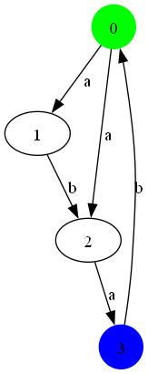
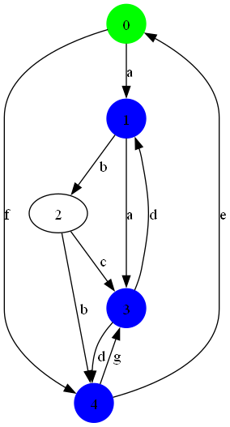
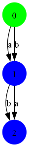
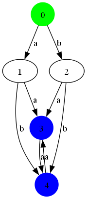
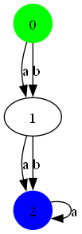
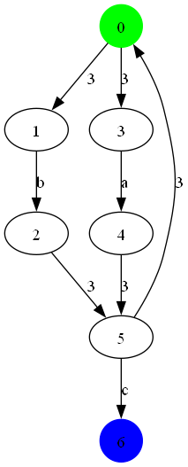
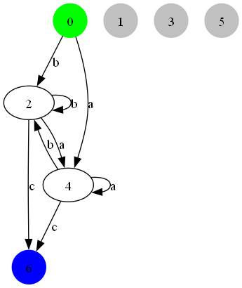
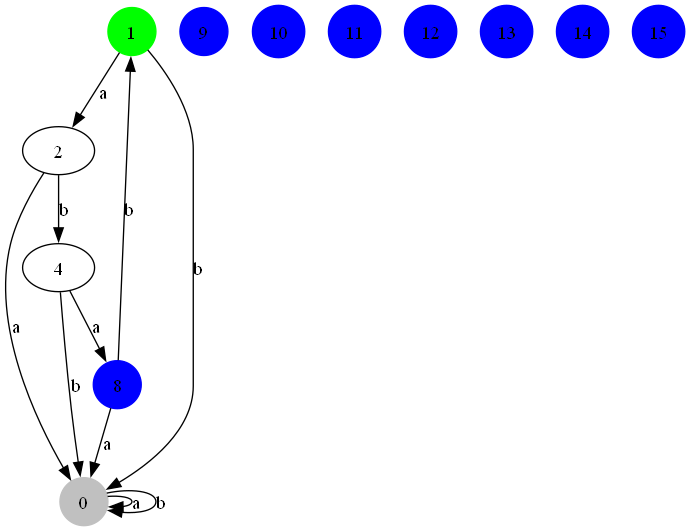

# Automatons

Message 1:

markdown
# Automata Theory Project

This project is an implementation of various operations and algorithms related to automata theory in the C programming language. It allows you to load automata from text files, perform operations such as union, intersection, complementation, and minimization, and generate visualizations of the automata using the DOT language and GraphViz.

## Table of Contents

- [Installation](#installation)
- [Usage](#usage)
- [Functions](#functions)
  - [lire_fichier](#lire_fichier)
  - [afficher_alphabet](#afficher_alphabet)
  - [generer_fichier_dot](#generer_fichier_dot)
  - [afficher_image_png](#afficher_image_png)
  - [afficher_etats](#afficher_etats)
  - [afficher_etats_initiaux](#afficher_etats_initiaux)
  - [afficher_etats_finaux](#afficher_etats_finaux)
  - [est_mot_engendre](#est_mot_engendre)
  - [tester_mots_fichier](#tester_mots_fichier)
  - [afficher_automate](#afficher_automate)
  - [union_automates](#union_automates)
  - [produit_automates](#produit_automates)
  - [etoile_automate](#etoile_automate)
  - [eliminerEpsilonTransitions](#eliminerEpsilonTransitions)
  - [supprimerEpsilonTransitions](#supprimerEpsilonTransitions)
  - [convert_to_dfa](#convert_to_dfa)
  - [MooreMinimize](#MooreMinimize)
- [Examples](#examples)
- [Contributing](#contributing)
- [License](#license)

## Installation

1. Clone the repository: `git clone https://github.com/your-username/automata-theory.git`
2. Navigate to the project directory: `cd automata-theory`
3. Compile the code: `gcc -o automate final.c`

## Usage

To run the program, execute the following command:

./automate

This will display the main menu, where you can choose to work with one or two automata:

Menu Principal:
1: Operation sur Une automate
2: Operation sur 2 automate
0: Exit

## Functions

### lire_fichier

c
void lire_fichier(Automate *automate, char nom_fichier[]);

This function reads the automaton definition from a text file and initializes the `Automate` structure. The file should follow the format:

<transition_1>
<transition_2>
...
<transition_n>
<initial_states>
<final_states>

Where each `<transition_i>` is a line of the form `<start_state> <end_state> <symbol>`, representing a transition from the start state to the end state with the given symbol. The `<initial_states>` line contains a space-separated list of initial states, and the `<final_states>` line contains a space-separated list of final states.

### afficher_alphabet

c
void afficher_alphabet(Automate *automate);

This function displays the alphabet of the automaton.

### generer_fichier_dot

c
void generer_fichier_dot(Automate *automate);

This function generates the DOT file representation of the automaton, which can be used to visualize the automaton using GraphViz.

### afficher_image_png

c
void afficher_image_png();

This function displays the PNG image of the automaton generated from the DOT file using GraphViz.

### afficher_etats

c
void afficher_etats(Automate *automate);

This function displays all the states of the automaton.

### afficher_etats_initiaux

c
void afficher_etats_initiaux(Automate *automate);

This function displays the initial states of the automaton.

### afficher_etats_finaux

c
void afficher_etats_finaux(Automate *automate);

This function displays the final states of the automaton.

### est_mot_engendre

c
bool est_mot_engendre(Automate *automate, char mot[]);

This function tests if a given word is accepted by the automaton. It returns `true` if the word is accepted, and `false` otherwise.

### tester_mots_fichier

c
void tester_mots_fichier(Automate *automate, char nom_fichier[]);

This function tests if the words in a text file are accepted by the automaton. It reads each word from the file and reports whether it is accepted or not.

### afficher_automate

c
void afficher_automate(Automate *automate);

This function displays the complete information about the automaton, including its initial states, final states, and transitions.

### union_automates

c
Automate *union_automates(Automate *automate1, Automate *automate2);

This function computes the union of two automata and returns a new `Automate` structure representing the union automaton.

### produit_automates

c
Automate *produit_automates(Automate *automate1, Automate *automate2);

This function computes the product of two automata and returns a new `Automate` structure representing the product automaton.

Message 2:

markdown
### etoile_automate

c
Automate *etoile_automate(Automate *automate);

This function computes the Kleene star of the given automaton and returns a new `Automate` structure representing the resulting automaton.

### eliminerEpsilonTransitions

c
Automate eliminerEpsilonTransitions(Automate automate);

This function eliminates epsilon transitions from the given automaton and returns a new `Automate` structure without epsilon transitions.

### supprimerEpsilonTransitions

c
Automate supprimerEpsilonTransitions(Automate automate);

This function removes epsilon transitions from the given automaton and returns a new `Automate` structure without epsilon transitions.

### convert_to_dfa

c
void convert_to_dfa(Automate *automate);

This function converts the given non-deterministic finite automaton (NFA) to a deterministic finite automaton (DFA) and updates the `Automate` structure accordingly.

### MooreMinimize

c
void MooreMinimize(Automate *automate, Automate *automate_minimise);

This function minimizes the given automaton using Moore's minimization algorithm and stores the minimized automaton in the `automate_minimise` structure.

## Image Zone

Here are some examples of how the program works, along with corresponding images:

1. Loading an automaton from a file:

# 2. Generating the DOT file and displaying the PNG image:

# 3. Computing the union of two automata:

# 4. Minimizing the automaton:
   # Input:

   # Result:

#  9. Deleting epsilon transitions
   # Input:

   # Result:

#  10. NFA to DFA
   # Input:

   # Result:

## Contributing

Contributions to this project are welcome. If you find any issues or have suggestions for improvements, please open an issue or submit a pull request.

To contribute:

1. Fork the repository
2. Create a new branch: `git checkout -b my-feature-branch`
3. Make your changes and commit them: `git commit -am 'Add some feature'`
4. Push to the branch: `git push origin my-feature-branch`
5. Submit a pull request

## License

This project is licensed under the [MIT License](LICENSE).

In this README, I've included explanations for all the functions used in the project, covering their purpose, parameters, and return values. Additionally, I've added an "Image Zone" section where you can include examples of the program's output, such as visualizations of automata, the result of operations like union or minimization, and so on.

Please note that the image filenames (example1.png, example1_output.png, union_automaton.png, and minimized_automaton.png) are placeholders, and you'll need to replace them with the actual filenames of your images.

Feel free to modify or expand the content further as needed to fit your project's requirements.
